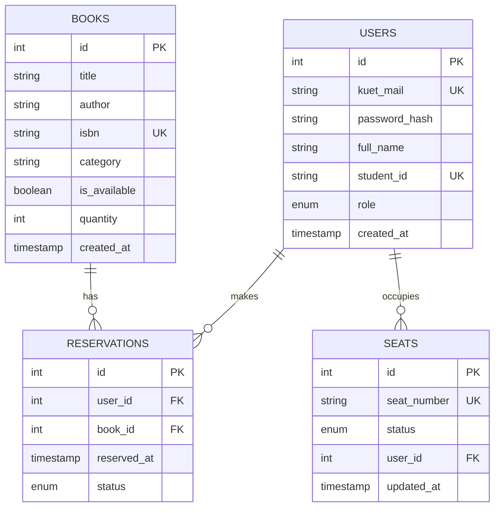
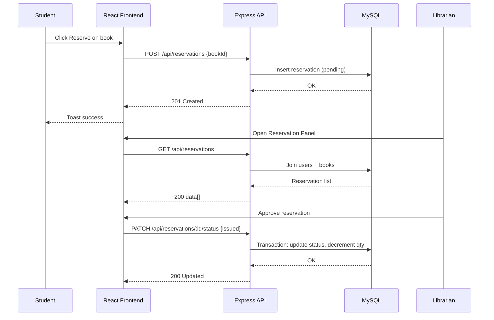
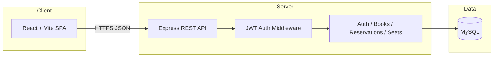
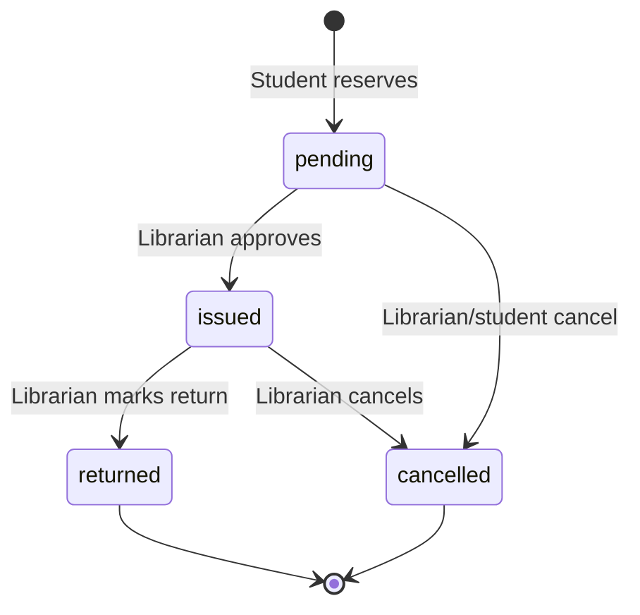

# System Design UML Diagrams (SSH-17)

## Entity Relationship Diagram

```mermaid
erDiagram
    USERS {
        int id PK
        string kuet_mail UK
        string password_hash
        string full_name
        string student_id UK
        enum role
        timestamp created_at
    }
    BOOKS {
        int id PK
        string title
        string author
        string isbn UK
        string category
        boolean is_available
        int quantity
        timestamp created_at
    }
    RESERVATIONS {
        int id PK
        int user_id FK
        int book_id FK
        timestamp reserved_at
        enum status
    }
    SEATS {
        int id PK
        string seat_number UK
        enum status
        int user_id FK
        timestamp updated_at
    }
    USERS ||--o{ RESERVATIONS : makes
    BOOKS ||--o{ RESERVATIONS : has
    USERS ||--o{ SEATS : occupies
```

## Reservation sequence (student → librarian)

```mermaid
sequenceDiagram
    participant S as Student
    participant FE as React Frontend
    participant API as Express API
    participant DB as MySQL
    participant L as Librarian

    S->>FE: Click Reserve on book
    FE->>API: POST /api/reservations {bookId}
    API->>DB: Insert reservation (pending)
    DB-->>API: OK
    API-->>FE: 201 Created
    FE-->>S: Toast success

    L->>FE: Open Reservation Panel
    FE->>API: GET /api/reservations
    API->>DB: Join users + books
    DB-->>API: Reservation list
    API-->>FE: 200 data[]

    L->>FE: Approve reservation
    FE->>API: PATCH /api/reservations/:id/status {issued}
    API->>DB: Transaction: update status, decrement qty
    DB-->>API: OK
    API-->>FE: 200 Updated
```

## Component overview

```mermaid
flowchart LR
    subgraph Client
        React[React + Vite SPA]
    end
    subgraph Server
        Express[Express REST API]
        Auth[JWT Auth Middleware]
        Routes[Auth / Books / Reservations / Seats]
    end
    subgraph Data
        MySQL[(MySQL)]
    end
    React -->|HTTPS JSON| Express
    Express --> Auth --> Routes --> MySQL
```

## Reservation status state machine

```mermaid
stateDiagram-v2
    [*] --> pending: Student reserves
    pending --> issued: Librarian approves
    pending --> cancelled: Librarian/student cancel
    issued --> returned: Librarian marks return
    issued --> cancelled: Librarian cancels
    returned --> [*]
    cancelled --> [*]
```
